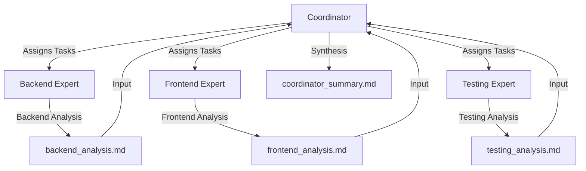

# TechRadar Crew

Welcome to the TechRadar Crew project, powered by [crewAI](https://crewai.com). This project implements a multi-agent system for analyzing and evaluating technologies across different domains using a crew of specialized AI agents.

## Project Structure

```
tech_radar/
├── src/
│   ├── crew.py          # Crew and agent definitions using @CrewBase
│   ├── main.py          # Entry point and execution logic
│   ├── files/           # Output files directory
│   ├── config/          # Configuration files
│   │   ├── agents.yaml  # Agent configurations
│   │   └── tasks.yaml   # Task configurations
│   └── tools/           # Custom tools
├── .venv/               # Virtual environment
└── pyproject.toml       # Project configuration
```

## Crew Workflow



The diagram above illustrates the sequential workflow of the TechRadar crew:
1. The Coordinator agent assigns tasks to the specialized experts
2. Each expert performs their analysis and generates a report
3. The Coordinator synthesizes the findings into a final summary

## Installation

1. Ensure you have Python >=3.10 <3.13 installed
2. Create and activate a virtual environment:
```bash
python -m venv .venv
# On Windows:
.venv\Scripts\activate
# On Unix/MacOS:
source .venv/bin/activate
```

3. Install dependencies:
```bash
pip install crewai[tools]
pip install -e .
```

4. Add your `OPENAI_API_KEY` to the `.env` file in the project root:
```
OPENAI_API_KEY=your_api_key_here
```

## Configuration

The project uses YAML configuration files for agents and tasks:

- `src/config/agents.yaml` - Define your agents' roles and capabilities
- `src/config/tasks.yaml` - Define your tasks' objectives and requirements

The crew is implemented using the `@CrewBase` decorator with specialized agents:
- Backend Expert
- Frontend Expert
- Testing Expert
- Coordinator

## Running the Project

1. Make sure you're in the project root directory
2. Ensure your virtual environment is activated
3. Run the crew:
```bash
crewai run
```

This will execute the technology radar analysis using a sequential process and generate reports in the `src/files/` directory.

## Output Files

The analysis produces several output files in the `src/files/` directory:
- `backend_analysis.md` - Backend technology evaluation
- `frontend_analysis.md` - Frontend technology evaluation
- `testing_analysis.md` - Testing technology evaluation
- `coordinator_summary.md` - Final synthesis and recommendations

## Customization

You can customize the crew's behavior by:
1. Modifying the agent configurations in `agents.yaml`
2. Adjusting task definitions in `tasks.yaml`
3. Adding custom tools in the `tools/` directory
4. Modifying the process type in `crew.py` (sequential/hierarchical)

## Troubleshooting

If you encounter import errors:
1. Ensure you're in the project root directory
2. Verify your virtual environment is activated
3. Check that you've installed the package in development mode (`pip install -e .`)
4. Make sure your `PYTHONPATH` includes the project root

## Support

- [Documentation](https://docs.crewai.com)
- [GitHub Repository](https://github.com/joaomdmoura/crewai)
- [Discord Community](https://discord.com/invite/X4JWnZnxPb)
